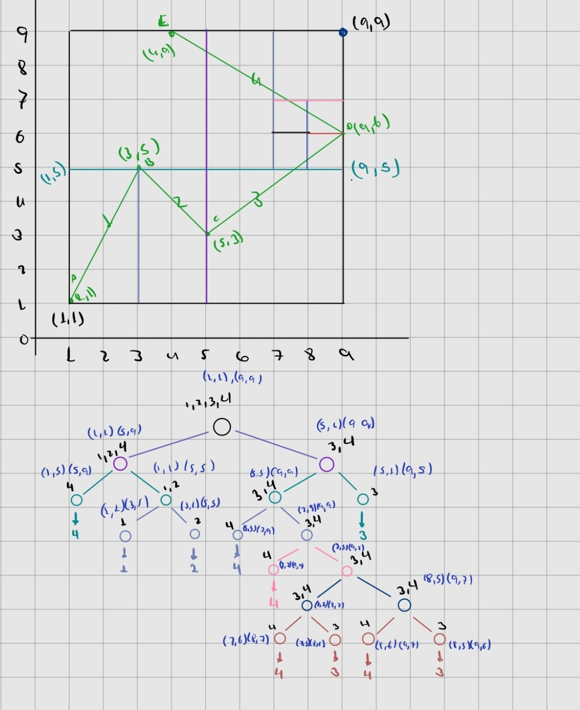

# Proyecto Final EDA

Este proyecto implementa una estructura con el concepto de KD-tree que divide el espacio recursivamente a la mitad, alternano entre eje x e y hasta que haya solo una arista contenida en el sector, esto facilita la busqueda de la arista más cercana a un punto de consulta dado.

## Requisitos

Para compilar y ejecutar este programa:

- Visual Studio Code
- Compilador `g++`

## Instrucciones

### Comando de Compilación:

g++ main.cpp -o main

### Comando de Ejecución:

.\main

## Ejemplo de arbol

